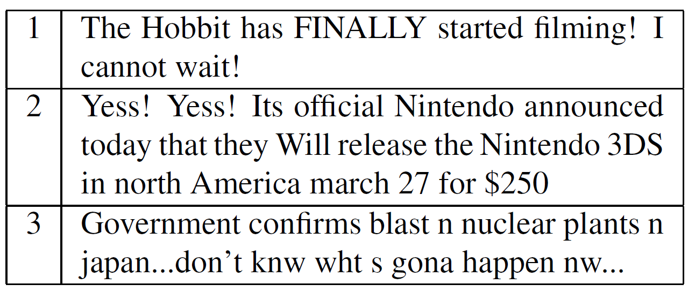
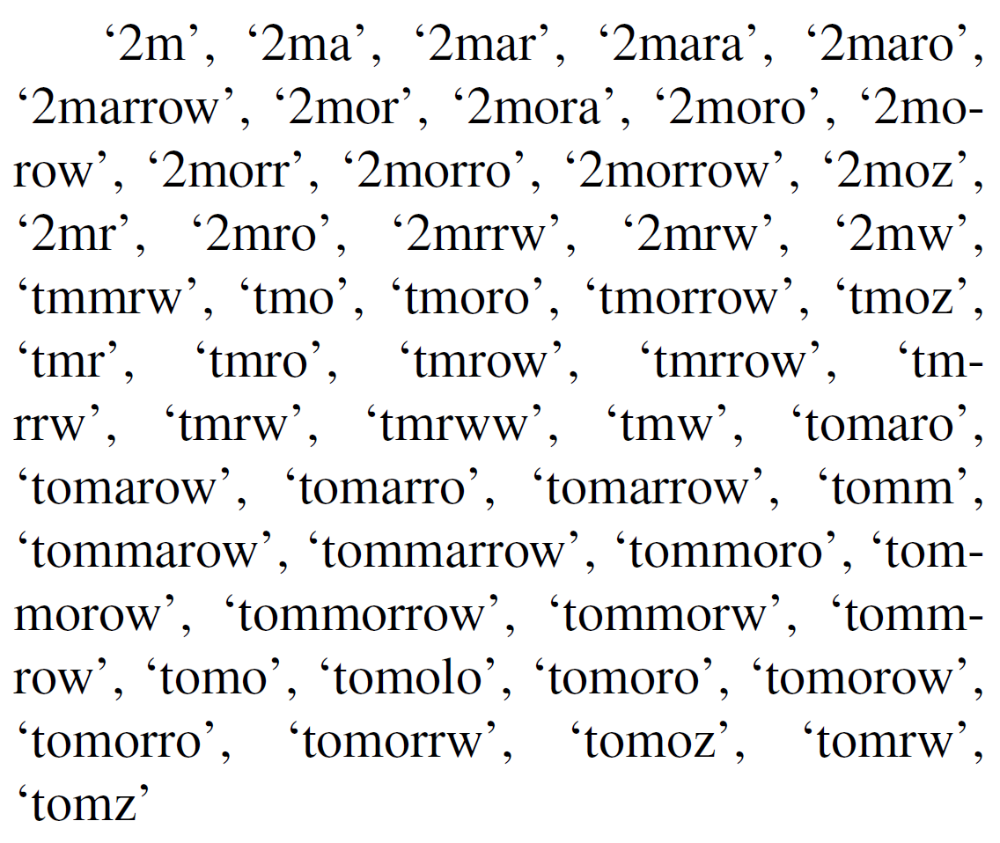
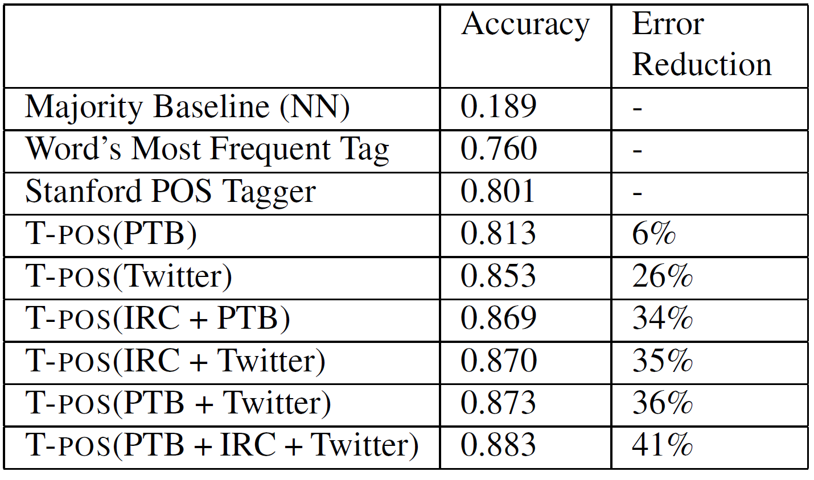
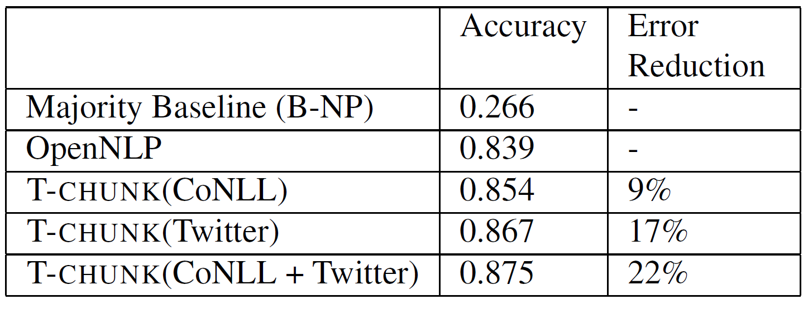
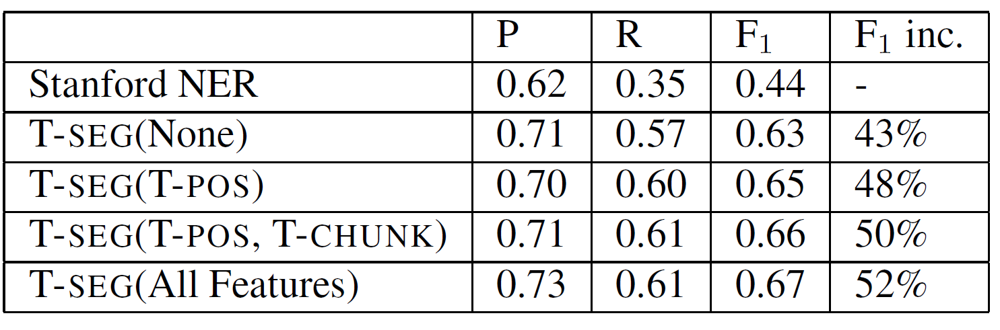
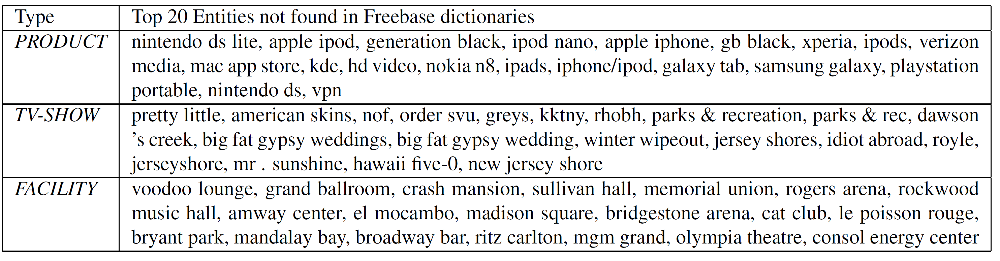
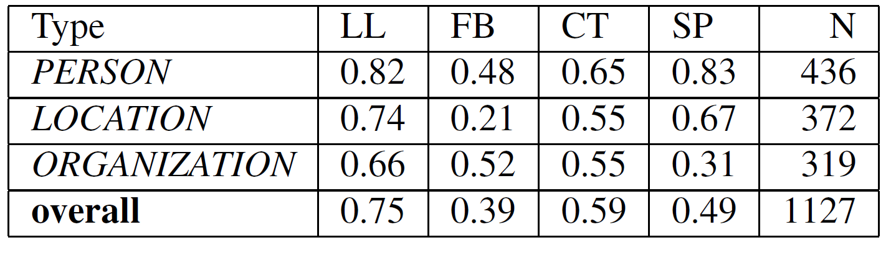
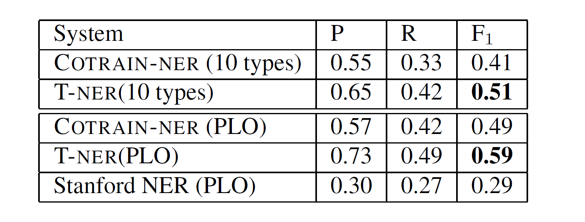

# Named Entity Recognition in Tweets: An Experimental Study

Tweets are generally noisy and informal and hence the standard NLP tools is severely degraded on these tweets. 

This paper addresses this issue by rebuilding the NLP pipeline with POS tagging, chunking and named-entity recognition. In this paper, a new T-NER system which is compared with the Stanford NER system and is found out to give double the F1 score than that of Stanford NER system. 
## Introduction
In many social media sites such as Facebook and Twitter, the language used is pretty noisy and informal. Now, as Twitter consists of data of the past and the tweets keep updating to the present, it is a huge corpus. Hence, we can consider named-entity recogntion, information extracting and text mining over these tweets. It is observed that named entity classification is difficult for 2 reasons 

- Tweets contain plethora of disticntive named entity types
- Due to twitter's 140 character limit, the tweets lack sufficient contest to determine the entity type.


<center><b>Table 1: Examples of noisy text in tweets.</b></center>
<br>

To address these problems, the following contributions were made. 

1. By utilizing in-domain, outof-domain, and unlabeled data, it was able to substantially boost performance.
2. LabeledLDA is applied, utilizing constraints based on an open-domain database (Freebase) as a source of supervision.

## Shallow Syntax in Tweets

In this section, 2 fundamental NLP tasks were studied.
- POS tagging
- noun-phrase chunking

### Parts of Speech Tagging

In this task, previously it was thought that wach word would be assigned to the most frequent tag and to assign each of the word out of the vocabulary we use the most common POS tag. This method works well in the Brown corpus but it is much weaker on the twttier data because the number of OOV(out of vocabulary) words are way high in the twitter corpus. For example, the word 'n' is used instead if 'in'. One more interesting observation is, the state-of-the-art Stanford POS tagger also performs poorly on the Twitter data. These are due to 2 reasons.

1. Due to unreliable capitalization, common nouns were being classified to proper nouns. Also, interjections and verbs were being classified as nouns. 

2. Grammar of tweets was pretty different from the news text(corpus on which Stanford POS was trained).

To overcome these difficulties, in this paper, 800 tweets were manually annotated from the Penn TreeBank tag set and then used it as training set. Secondly, new tags were added such as retweets, @usernames, #hashtags and urls.  

To address the OOV issue, hierarchical clustering was performed to group words which are distributionally similar. Each word is uniquey represented by a bit string based on the path from the root of the resulting hierarchy to the word's leaf. For example, the following lexical variations on the word "tomorrow" from one cluster are shown below. 

<center><b>Fig 1: Cluster of words similar to "tomorrow".</b></center>
<br>

Next, T-POS (proposed POS algorithm ) uses CRF's because they can model strong dependencies between adjacent POS tags and make highly correlated features. 

By incorporating the above changes, T-POS outperforms the Stanford tagger by reducing the error upto 26%. 

The below table compares the performance of T-POS by different in domain data.



<center><b>Table 2: POS tagging performance on tweets. By training
on in-domain labeled data, in addition to annotated IRC
chat data, we obtain a 41% reduction in error over the
Stanford POS tagger.</b></center>
<br>

### Shallow Parsing

Shallow parsing is basically the identification of non-recursive phrases such as noun, verb, and prepositional phrases. This would benefit many applications such as Information extraction and Named Entity Recognition. 
The following steps were followed to achieve Shallow Parsing:

1. Annotate same set of 800 tweets using CoNLL shared task.

2. Using set of features described by Sha and Pereira (2003) additional to the heirarchical clustering mentioned above.

3. POS tag features extracted based on output given by T-POS

4. Finally this Model is known as T-CHUNK.

The below table reports T-CHUNK's performance at shallow parsing of tweets and it obtained a 22% reduction in error.


<center><b>Table 4: Token-Level accuracy at shallow parsing tweets.
We compare against the OpenNLP chunker as a baseline.</b></center>
<br>


### Capitalization

One of the key feature for recognizing named entities is Capitalization. But in tweets it is very less reliable. This is because, in some tweets capitalization is informative but in some other tweets, non - entity words are capitalized just for emphasis. 

To overcome this issue, we have to train a model which says is the capitalization is informative or otherwise. Therefore, in this paper a T-CAP model is built which predicts whether or not a tweet is informatively capitalized. Now, this output is used for the Named Entity Recognition as a feature. 

When compared with majority baseline, it was shown that capitalization was always informative.


<center><b>Table 5: Performance at predicting reliable capitalization.</b></center>
<br>
## Named Entity Recognition


Similar to POS tagging and shallow parsing, off the shelf Named Entity Recognition perform poorly on tweets. For example 


We can observe the "Yess" is mistankenly classified to a named entity. Secondly, "North America" should be classified as Location, but not just "America". 

In this paper, classification and segmentation are treated as saperate tasks. Adding to this, larger annotated dataset was take with a randomly sampled set 2,400 tweets for Named Entity Recognition. 

### Segmenting Named Entities

As stated previously, Capitalization in twitter is less informative and hence the models should rely less heavily on this aspect and features were used from T-CAP. 

T-SEG is the method proposed for SNE. IOB encoding is used for representing segmentations and after that it uses, CRFs for learning. Orthographic, contextual and dictionary features were collected from Freebase. Additionally, Brown clusters and ouptuts of T-POS, T-CHUNK and T_CAP were used.

The below table shows the performance of segementing entities for randomly sampled 2400 tweets and a 4 fold cross validation.


<center><b>Table 6: Performance at segmenting entities varying the
features used. “None” removes POS, Chunk, and capitalization
features. Overall we obtain a 52% improvement
in F1 score over the Stanford Named Entity Recognizer.</b></center>
<br>


### Classifying Named Entities


Twitter has many in frequent entity types and therefore gathering sufficient training data is a difficult task.  Additionally, the context to determine the named entity is not sufficient. Eg : 

KKTNY in 45min......

It is impossible to determine the entity os KKTNY without any prior knowledge. 

To handle this problem, Freebase open domain ontology was used which has large list of entities and types as distant supervision. 

##### Freebase Baseline

Even though Freebase has a large coverage, it is inadequate to classsify named entities in context. For Eg, "China" could refer to a country, a band, a person or a film. This is observed because 35% of the data occurs in mutually exclusive freebase dictionaries. 

##### Distant Supervision with Topic Models

For modelling entities and types, LabeledLDA was applied. This models each entity as a mixture of types rather than using a single hidden variable to represent type of each mention. This would information about an entity's distribution over different types and naturally handling ambiguous entity strings whose mention could refer to multiple types.

Each entity is associated with a list of words.  In Standard LDA, is associated with a distribution over topics,  Multinomial \theta_{e}  and each topic is associated with a distribution over words Multinomial \beta_{t}. Additionally there is a one-to-one mapping between topics and Freebase type dictionaries. 

```
for each type: t = 1 : T do
	Generate \beta_{t} according to symmetric Dirichlet
	distribution Dir(\eta).
end for
for each entity string e = 1 : |E| do
	Generate \theta_{e} over FB[e] according to Dirichlet
	distribution Dir(\alpha_{FB[e]}).
	for each word position i = 1 : N_{e} do
		Generate z_{e,i} from Mult(\theta_{e}).
		Generate the word w_{e,i} from Mult(\beta_{z_{e,i}}).
	end for
end for

```

For entities which were not encountered during training, a prior was used based on the distribution of types across all entities.  

#### Classification Experiments

To evaluate T-CLASS, 2400 tweets were manually annotated with  10 types which are both popular on Twitter and have good coverage in Freebase. **Person, Geo-Location, Company, Product, Facility, TV-show, Movie, Sportsteam, Band, and Other**. These are only used for testing but not training T-CLASS which is completely dependent on Distant Supervision.

##### Training

1. For gathering unlabeled data, T-SEG(entity segmenter) was used.

2. For each entity string, words occuring in a context window of 3 words from all mentions in the data were collected.

3. Gibbs sampling for 1000 iterations was run, using the last sample to estimate entity tyoe distributions, in addition to word type disgtributions. 

4. The below table shows 20 entities not found in free base, whose probability distribution assigns the highest probability to the selected types.

The below table the 20 entities which are not found in freebase and whose posterior distribution assigns higest probability to selected types. 


<center><b>Table 7: Example type lists produced by LabeledLDA. No entities which are shown were found in Freebase; these are
typically either too new to have been added, or are misspelled/abbreviated (for example rhobh=”Real Housewives of
Beverly Hills”). In a few cases there are segmentation errors.</b></center>
<br>

##### Results

Below table presents classification results of T-CLASS compared against many other models.


<center><b>Table 8: Named Entity Classification performance on the
10 types. Assumes segmentation is given as in (Collins
and Singer, 1999), and (Elsner et al., 2009).</b></center>
<br>
Below tables present break down of F1 scores by type.


<center><b>Table 9: F1 classification scores for the 3 MUC types
PERSON, LOCATION, ORGANIZATION. Results are
shown using LabeledLDA (LL), Freebase Baseline (FB),
DL-Cotrain (CT) and Supervised Baseline (SP). N is the
number of entities in the test set.</b></center>
<br>


<center><b>Table 10: F1 scores for classification broken down by
type for LabeledLDA (LL), Freebase Baseline (FB), DLCotrain
(CT) and Supervised Baseline (SP). N is the number
of entities in the test set.</b></center>
<br>

##### End to end system

Below table presents the end to end performance on segmentation and classification.

<center><b>Table 12: Performance at predicting both segmentation
and classification. Systems labeled with PLO are evaluated
on the 3 MUC types PERSON, LOCATION, ORGANIZATION.</b></center>
<br>
## Conclusion

1. Existing tools for POS tagging, Chunking and named Entity Recogniton were demonstrated that they perform poorly on tweet data.

2. To address this challenge, tweets have been annotated and
tools were builtwhich were trained on unlabeled, in-domain and outof-domain data.

3. Benefits of of features generated from T-POS and T-CHUNK were shown.

4. Named entity classification is a challenging task on twitter data because of their terse nature, lacking context, lots of types of entities which require large training data. 

5. To overcome the above problem, a distantly supervised approach based on LabeledLDA was chosen which led to increase in F1 Score. 

[Code can be seen here for POStagger](https://github.com/aritter/twitter_nlp)

